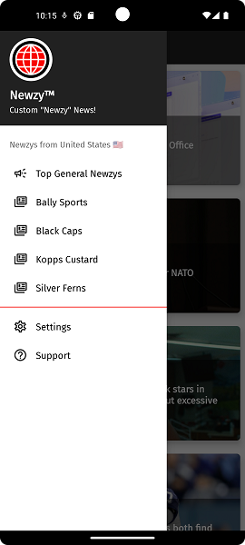
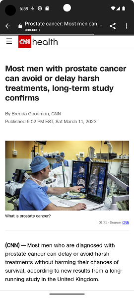
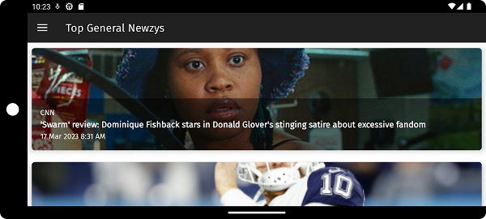

# Newzy

### Custom "Newzy" News

Simple and straightforward, Newzy gathers and displays the news results you want to see. These search results are affectionately called "Newzys."

## Getting Started

Newzy is activated with a free News API Key. Benefits of this key include up to 500 search requests per day (250 requests per 12 hours.) Get yours at [NewsAPI.org/register](https://newsapi.org/register). Once obtained, provide your 32-character key in Settings.

NOTE: during News API Key registration, check the box to \"add an attribution link.\" Newzy provides this link to NewsAPI.org within the app to satisfy this requirement. 

## Screenshots

   

## Built With

Android Studio 3.5.1

Gradle 5.4.1

API Level: 23. Android 6.0 (MARSHMALLOW)

## Versioning

1.4.1

## Author

[josephamcdonald](http://josephamcdonald.com)

## Design Features

**AndroidX libraries**

**REST/HTTP requests**

**JSON parsing**

**NavigationDrawer**

**MaterialCardView**

**RecyclerView**

**SwipeRefreshLayout**

**Picasso for imaging**

**CustomTabsIntent browser**

**Google "Fira Sans" Typeface**

**ViewHolder**

**AsyncTaskLoader**

**Adapter**

**ProgressBar**

## Acknowledgements

The [News API](https://newsapi.org/) is the great resource supplying this news app.

The theme is inspired from the [New Zealand All-of-Government Brand](https://www.ssc.govt.nz/govt-brand).

For example, [their official typeface (Fira Sans)](https://www.govt.nz/about/about-this-website/style-and-design/typography/#typefaces) is used throughout this app.

Also, the app's colors are inspired from [here](https://www.govt.nz/about/about-this-website/style-and-design/colours-and-graphics/#colours).

Black, white, gray and the Māori red are all represented. Loved the red contrast so much so that I used it for the app's "colorAccent." Some great info on the [Māori flag](https://nzhistory.govt.nz/media/photo/national-maori-flag).

A huge "thank you" to Heather. As a social media authority, she is an excellent resource for me to get ideas and feedback on my apps!