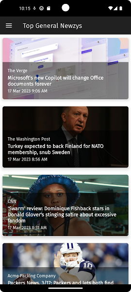

# Newzy

### Your Custom "Newzy" News

**Simple...Efficient...Free.** Newzy gathers and displays the news results you want to see. These results are affectionately called "Newzys."

## Getting Started

Newzy is activated with a free API token. Benefits of your personal token include up to 100 API requests per day. Once obtained, provide your 32-character token in Settings. Get your token at [GNews.io/register](https://gnews.io/register)

## Screenshots

   

## Built With

Android Gradle Plugin 7.0.3

Gradle 7.0.2

Target API Level: 31 Android 12.0 (S)

Min API Level: 26 Android 8.0 (OREO)

## Versioning

2.5.5

## Author

[josephamcdonald](http://portfolio.josephamcdonald.com)

## Design Features

**AndroidX libraries**

**REST/HTTP requests**

**JSON parsing**

**NavigationDrawer**

**MaterialCardView**

**RecyclerView**

**SwipeRefreshLayout**

**Picasso for imaging**

**CustomTabsIntent browser**

**Google "Fira Sans" Typeface**

**ViewHolder**

**AsyncTaskLoader**

**Adapter**

**ProgressBar**

## Acknowledgements

The theme is inspired from the [New Zealand All-of-Government Brand](https://www.ssc.govt.nz/govt-brand).

For example, [their official typeface (Fira Sans)](https://www.govt.nz/about/about-this-website/style-and-design/typography/#typefaces) is used throughout this app. The colors are inspired from [here](https://www.govt.nz/about/about-this-website/colours-images-and-logos/).

Black, white, gray and the Māori red are all represented. Loved the red contrast so much so that I used it for the app's "colorAccent." Some great info on the [Māori flag](https://nzhistory.govt.nz/media/photo/national-maori-flag).

A huge "thank you" to Heather. As a social media authority, she is an excellent resource for me to get ideas and feedback on my apps!